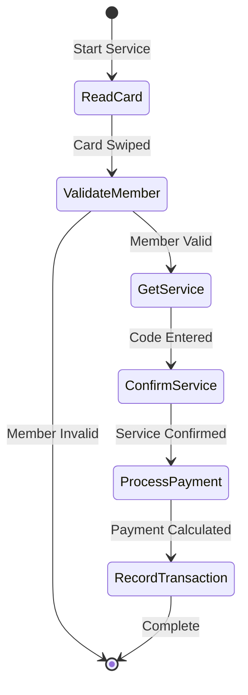
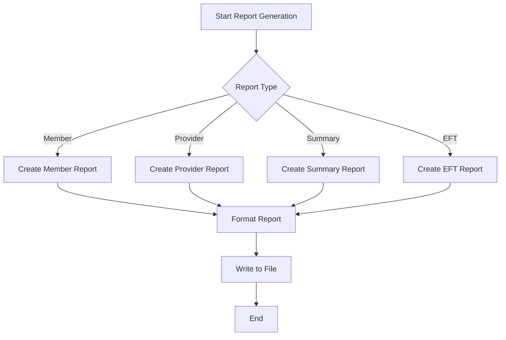
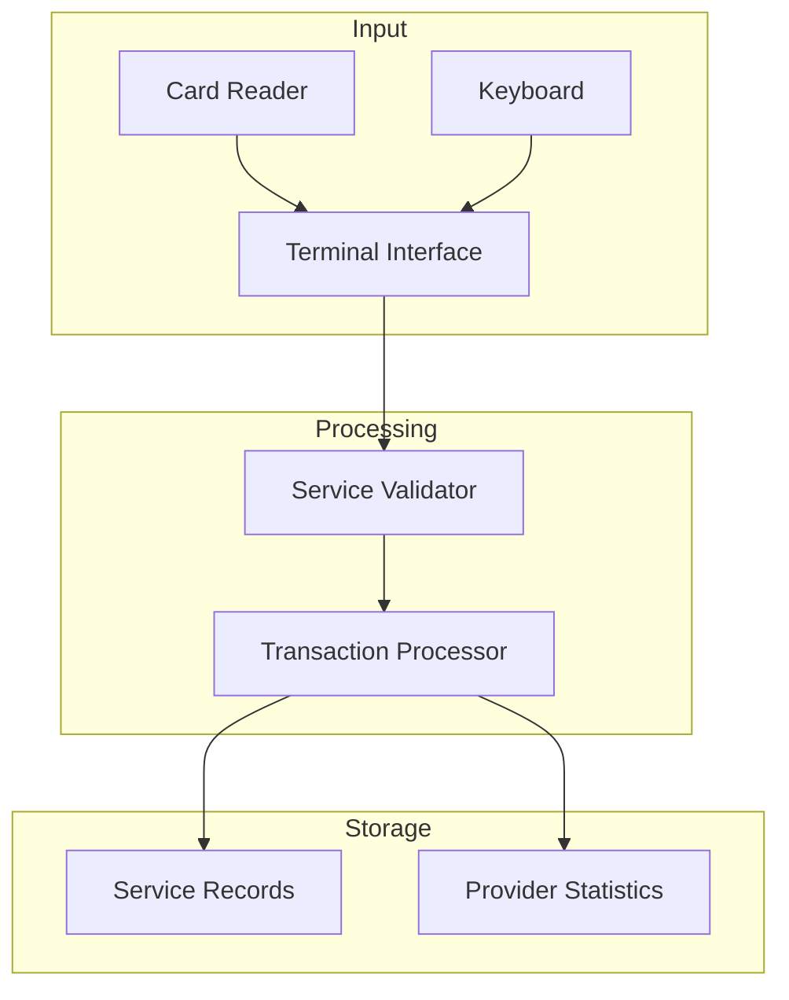
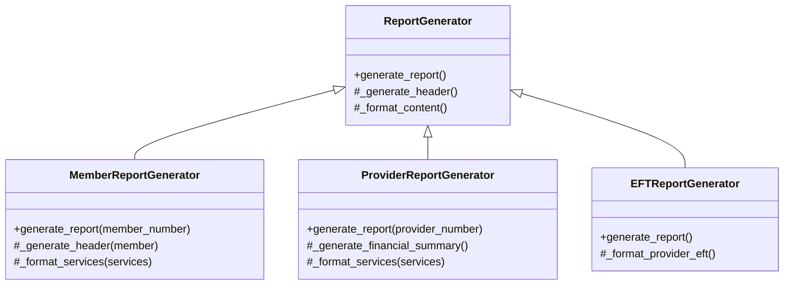
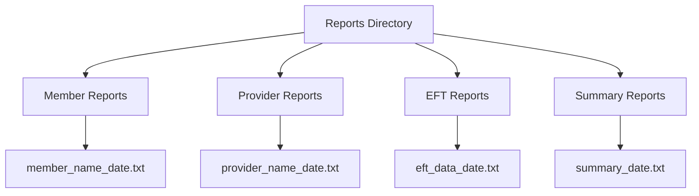

# ChocAn Data Processing System
Design Document

## 1. Introduction
This document describes the design and implementation of the ChocAn (Chocoholics Anonymous) data processing system, a software solution for managing healthcare services for chocolate addiction treatment.

### 1.1. Purpose and Scope
The purpose of this document is to detail the design decisions and implementation specifics of the ChocAn data processing system. The scope includes all data processing components specified in the requirements, including member management, provider interactions, service recording, and report generation. The design excludes communications software, terminal hardware design, accounting services, and EFT implementation, which are handled by other contractors.

### 1.2. Target Audience
This document is intended for:
- Software developers implementing or maintaining the ChocAn system
- System architects reviewing the design
- Project managers overseeing the implementation
- Quality assurance teams testing the system

### 1.3. Terms and Definitions
- **ChocAn**: Chocoholics Anonymous
- **Member**: An individual enrolled in ChocAn's healthcare program
- **Provider**: Healthcare professional providing services to ChocAn members
- **EFT**: Electronic Funds Transfer
- **Service Record**: Documentation of a healthcare service provided to a member
- **Provider Directory**: List of available services and their codes

## 2. Design Considerations

### 2.1. Constraints and Dependencies
1. **Technical Constraints**:
   - Terminal input/output must be simulated via keyboard and screen
   - Reports must be written to files rather than sent as email attachments
   - Member reports must be named using member name and date
   - Provider reports must follow similar naming convention

2. **Functional Constraints**:
   - Member numbers must be 9 digits
   - Provider numbers must be 9 digits
   - Service codes must be 6 digits
   - Comments limited to 100 characters
   - Name fields limited to 25 characters
   - Service names limited to 20 characters
   - City names limited to 14 characters
   - State codes must be 2 letters
   - ZIP codes must be 5 digits

### 2.2. Methodology
The system employs an object-oriented design methodology, chosen for its:
1. Natural mapping of real-world entities (members, providers, services) to classes
2. Encapsulation of data and operations
3. Modularity and maintainability
4. Easy extensibility for future features

Implementation uses Python for its:
- Rich standard library
- Clear syntax for rapid development
- Strong object-oriented support
- Cross-platform compatibility

## 3. System Overview
The ChocAn system consists of five main components:

1. **Data Management Layer**:
   - Member database
   - Provider database
   - Service records
   - Provider directory

2. **Terminal Interface Layer**:
   - Provider terminal simulation
   - Manager terminal simulation

3. **Service Processing Layer**:
   - Member validation
   - Service recording
   - Fee calculation

4. **Report Generation Layer**:
   - Member reports
   - Provider reports
   - Summary reports
   - EFT reports

5. **System Administration Layer**:
   - Member management
   - Provider management
   - System maintenance

## 4. System Architecture

### 4.1. Data Management Subsystem
The core classes managing system data:

#### 4.1.1. Member Class
```python
class Member:
    name: str  # 25 chars max
    number: str  # 9 digits
    street: str  # 25 chars max
    city: str  # 14 chars max
    state: str  # 2 letters
    zip_code: str  # 5 digits
    status: str  # active/suspended
```

#### 4.1.2. Provider Class
```python
class Provider:
    name: str  # 25 chars max
    number: str  # 9 digits
    street: str  # 25 chars max
    city: str  # 14 chars max
    state: str  # 2 letters
    zip_code: str  # 5 digits
    services_provided: List[ServiceRecord]
    weekly_consultations: int
    weekly_fee_total: float
```

#### 4.1.3. Service Class
```python
class Service:
    code: str  # 6 digits
    name: str  # 20 chars max
    fee: float
```

### 4.2. Service Processing Subsystem

#### 4.2.1. Terminal Interface Handler
```python
class TerminalInterface:
    def simulate_card_reader(self):
        # Handles card reading simulation
    def display_message(self, message):
        # Handles terminal display output
    def get_input(self, prompt):
        # Handles terminal input
```

#### 4.2.2. Service Validator
```python
class ServiceValidator:
    def validate_member_status(self):
        # Member validation logic
    def validate_service_code(self):
        # Service code validation
    def validate_provider(self):
        # Provider validation
```

#### 4.2.3. Transaction Processor
```python
class TransactionProcessor:
    def record_service(self):
        # Service recording logic
    def calculate_fee(self):
        # Fee calculation
    def update_provider_stats(self):
        # Provider statistics update
```

#### 4.2.4. Service Processing Flow


### 4.3. Report Generation Subsystem

#### 4.3.1. Report Factory
```python
class ReportFactory:
    def create_member_report(self):
        # Member report generation
    def create_provider_report(self):
        # Provider report generation
    def create_summary_report(self):
        # Summary report generation
    def create_eft_report(self):
        # EFT report generation
```

#### 4.3.2. Report Formatter
```python
class ReportFormatter:
    def format_member_report(self):
        # Member report formatting
    def format_provider_report(self):
        # Provider report formatting
    def format_summary_report(self):
        # Summary report formatting
```

#### 4.3.3. Report Writer
```python
class ReportWriter:
    def write_report(self):
        # File writing logic
    def create_filename(self):
        # Filename generation
```

#### 4.3.4. Report Generation Flow


## 5. Detailed System Design

### 5.1. [Previous sections remain the same]

### 5.2. Service Processing Implementation

#### 5.2.1. Terminal Interface Implementation
```python
class TerminalInterface:
    def simulate_card_reader(self, member_number=None):
        """Simulates card reader hardware"""
        if not member_number:
            member_number = input("Enter member number (or swipe card): ")
        return member_number.zfill(9)

    def display_message(self, message):
        """Simulates terminal display"""
        print(f"\nTerminal Display: {message}")

    def get_input(self, prompt):
        """Handles terminal input"""
        return input(f"\n{prompt}: ")
```

#### 5.2.2. Service Validation Implementation
```python
class ServiceValidator:
    def __init__(self, system):
        self.system = system

    def validate_member_status(self, member_number):
        """Complete member validation logic"""
        if not member_number.isdigit() or len(member_number) != 9:
            return False, "Invalid number format"
        
        if member_number not in self.system.members:
            return False, "Member not found"
            
        member = self.system.members[member_number]
        if member.status == "suspended":
            return False, "Member suspended"
            
        return True, "Member validated"

    def validate_service_code(self, service_code):
        """Service code validation with error checking"""
        if not service_code.isdigit() or len(service_code) != 6:
            return False, "Invalid code format"
            
        if service_code not in self.system.services:
            return False, "Service code not found"
            
        return True, "Service code valid"
```

#### 5.2.3. Transaction Processing Implementation
```python
class TransactionProcessor:
    def __init__(self, system):
        self.system = system

    def record_service(self, member_number, provider_number, 
                      service_code, service_date, comments=""):
        """
        Records a service transaction with full validation
        and error handling
        """
        try:
            # Create service record
            record = ServiceRecord(
                datetime.now().strftime("%m-%d-%Y %H:%M:%S"),
                service_date,
                provider_number,
                member_number,
                service_code,
                comments
            )
            
            # Update provider statistics
            provider = self.system.providers[provider_number]
            provider.services_provided.append(record)
            provider.weekly_consultations += 1
            
            # Calculate and update fee
            service = self.system.services[service_code]
            provider.weekly_fee_total += service.fee
            
            return True, "Service recorded successfully"
            
        except Exception as e:
            return False, f"Error recording service: {str(e)}"
```

#### 5.2.4. Data Flow Diagram


### 5.3. Report Generation Implementation

#### 5.3.1. Member Report Generation
```python
class MemberReportGenerator:
    def __init__(self, system):
        self.system = system

    def generate_report(self, member_number):
        """Generates detailed member service report"""
        member = self.system.members[member_number]
        filename = f"{member.name}_{datetime.now().strftime('%Y%m%d')}_report.txt"
        
        with open(filename, "w") as f:
            # Header
            f.write(self._generate_header(member))
            
            # Services
            services = self._get_member_services(member_number)
            f.write(self._format_services(services))
            
            # Summary
            f.write(self._generate_summary(services))
            
        return filename

    def _generate_header(self, member):
        """Creates formatted report header"""
        return f"""
Member Service Report
Date: {datetime.now().strftime('%m-%d-%Y')}
{'-'*50}
Name: {member.name}
Number: {member.number}
Address: {member.street}
        {member.city}, {member.state} {member.zip_code}
{'-'*50}\n\n"""
```

#### 5.3.2. Provider Report Generation
```python
class ProviderReportGenerator:
    def __init__(self, system):
        self.system = system

    def generate_report(self, provider_number):
        """Generates comprehensive provider report"""
        provider = self.system.providers[provider_number]
        filename = f"{provider.name}_{datetime.now().strftime('%Y%m%d')}_report.txt"
        
        with open(filename, "w") as f:
            # Header
            f.write(self._generate_header(provider))
            
            # Service details
            f.write(self._format_services(provider.services_provided))
            
            # Financial summary
            f.write(self._generate_financial_summary(provider))
            
        return filename

    def _generate_financial_summary(self, provider):
        """Generates financial summary section"""
        return f"""
Financial Summary
{'-'*50}
Total Consultations: {provider.weekly_consultations}
Total Fees: ${provider.weekly_fee_total:.2f}
{'-'*50}\n"""
```

#### 5.3.3. EFT Report Generation
```python
class EFTReportGenerator:
    def __init__(self, system):
        self.system = system

    def generate_report(self):
        """Generates EFT data file"""
        filename = f"eft_data_{datetime.now().strftime('%Y%m%d')}.txt"
        
        with open(filename, "w") as f:
            total_transfer = 0.0
            
            for provider in self.system.providers.values():
                if provider.weekly_fee_total > 0:
                    f.write(self._format_provider_eft(provider))
                    total_transfer += provider.weekly_fee_total
            
            f.write(f"\nTotal Transfer Amount: ${total_transfer:.2f}\n")
            
        return filename

    def _format_provider_eft(self, provider):
        """Formats provider EFT record"""
        return f"""
Provider: {provider.name}
Number: {provider.number}
Transfer Amount: ${provider.weekly_fee_total:.2f}
{'-'*50}\n"""
```

#### 5.3.4. Report Generation Class Diagram


#### 5.3.5. Report File Structure

